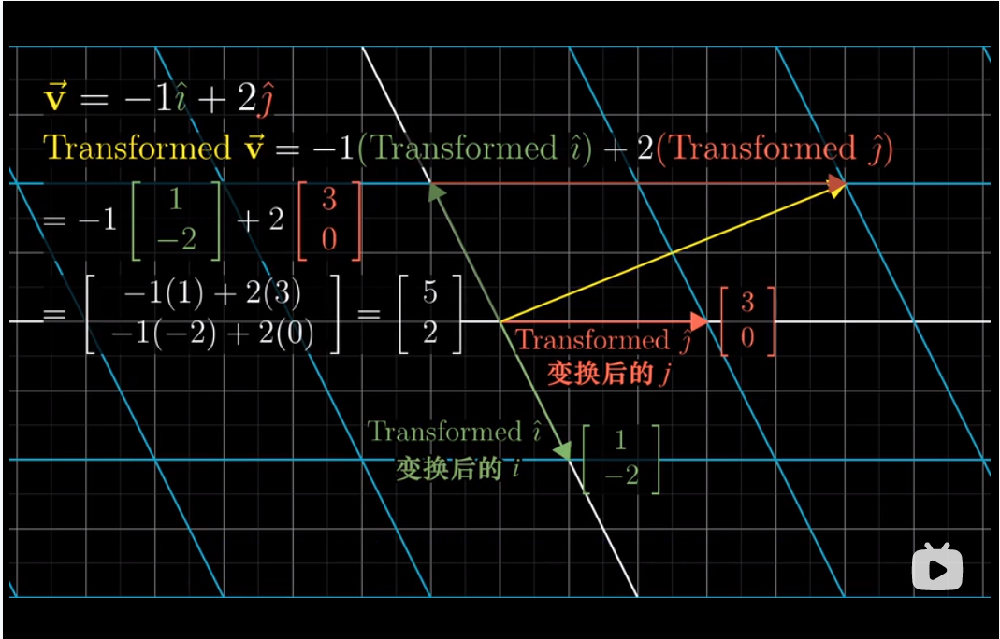
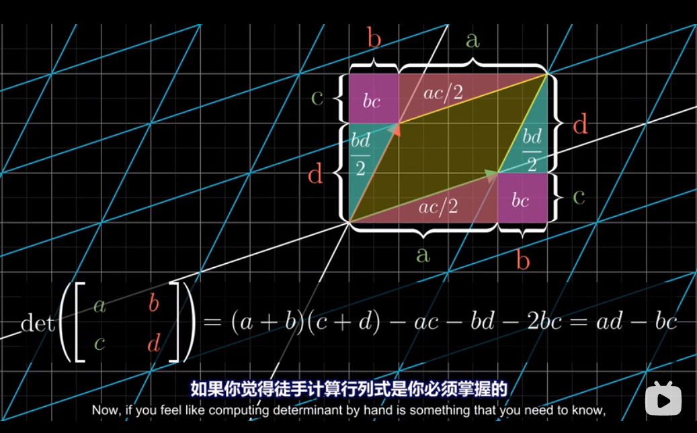

.. linear algebra documentation master file, created by
   sphinx-quickstart on Wed Nov 11 23:13:35 2020.
   You can adapt this file completely to your liking, but it should at least
   contain the root `toctree` directive.

Welcome to linear algebra's documentation!
==========================================

.. toctree::
   :maxdepth: 2
   :caption: Contents:

`线性代数的本质 <https://www.bilibili.com/video/BV1ys411472E>`_
==================================================================

* `Manim Kindergarten 中文教程文档 <https://manim.ml/index.html>`_

------------

-----------------
P4
-----------------

.. raw:: html

    <iframe src="https://player.bilibili.com/player.html?aid=6731067&bvid=BV1ys411472E&cid=10959714&page=4&danmaku=0" width="750" height="500" scrolling="no" border="0" frameborder="no" framespacing="0" allowfullscreen="true"> </iframe>

.. math::

    \begin{bmatrix} 
     1 & 3\\ 
    -2 & 0 
    \end{bmatrix}  
    \begin{bmatrix} 
    -1 \\ 
    2  
    \end{bmatrix} =
    \begin{bmatrix} 
    5 \\ 
    2  
    \end{bmatrix}

------------

-----------------
P5
-----------------

.. raw:: html

    <iframe src="https://player.bilibili.com/player.html?aid=6731067&bvid=BV1ys411472E&cid=10959714&page=5&danmaku=0" width="750" height="500" scrolling="no" border="0" frameborder="no" framespacing="0" allowfullscreen="true"> </iframe>

-----------------
P7
-----------------

.. raw:: html

    <iframe src="https://player.bilibili.com/player.html?aid=6731067&bvid=BV1ys411472E&cid=10959714&page=7&danmaku=0" width="750" height="500" scrolling="no" border="0" frameborder="no" framespacing="0" allowfullscreen="true"> </iframe>

-----

* `eigen 中四元数、欧拉角、旋转矩阵、旋转向量 <https://www.cnblogs.com/lovebay/p/11215028.html>`_

Indices and tables
==================

* :ref:`genindex`
* :ref:`modindex`
* :ref:`search`
